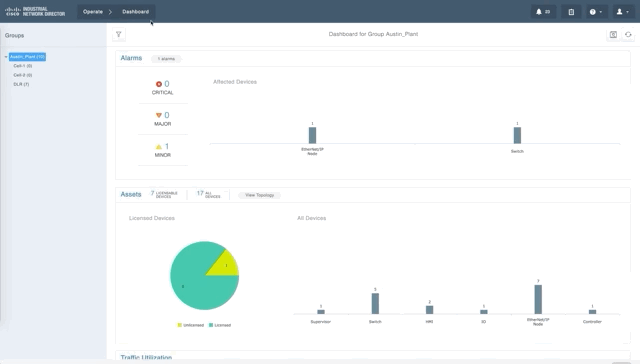

# Industrial Network Director - Automated asset discovery using Ansible

This project utilises Cisco Industrial Network Director (IND) - a network management tool specifically for operational technology networks, to automate discovery of devices on a network through the use of ansible playbooks to dynamically create discovery profiles on IND using user provided information. 

Industrial Network Director utilses the concept of discovery profiles which are able to actively scan the OT network using automation protocols such as Modbus, BACnet Ethernet/IP, Profinet and OPC-UA. This allows for IT and OT to understand the assets in these environments.

> https://www.cisco.com/c/en/us/products/cloud-systems-management/industrial-network-director/index.html

The challenge however exists in the fact that these networks can be very large and manual creation of discovery profiles is sometimes unfeasible. Therefore with this playbook we have automated part of that process.

With the user providing a csv file of the estimated asset information (IP addressing and discovery profile requried) this playbook is able to automatically create the discovery profiles for the devices it is instructed to discover within the IND tool.

> Prerequsites for this project - Python 2.7 or later, Ansible - This project assumes some knowledge of Ansible

> To run these scripts you will need an instance of Industrial Network Director running. dcloud.cisco.com has an "Cisco Industrial Network Director v3" demo which can be used for this integration or alternatively you can download IND from the cisco.com website, a fresh install has a 90 day trial license. https://software.cisco.com/download/home/286310815/type/286310951/release/1.6.1

## Steps:

#### Step 1:
The first step to using this project is to build our csv file which will input into the playbook when it is run. We have included a sample csv in the project files, each line CSV will correspond to a discovery profile. An example format of a csv file can be seen below and also in the 'devices.csv' file within the repo. A brief overview of the files contents can be seen below.
    
```"name;accessProfileId;protocol;startip;endip;netmask"
name;accessProfileId;protocol;startip;endip;netmask
test01;20100;OPC-UA;192.168.0.0;192.168.0.255;255.255.255.0
test02;20100;OPC-UA;10.10.10.0;10.10.10.255;255.255.255.0
```

* Name - Name for the profile for within IND
accessProfileID - Industrial Network Director uses the concept of access profiles to instruct the system which protocols to scan on. These currently have to be manually created within IND. For a guide on creating the profiles please see the internal documentation on your IND system. 

    *Currently working to remove the need for an accessProfileId field to automatically create access profiles based on protocol*

    It is best practice to make these profiles as specific as possible as we are carrying out an active scan. Therefore pruning un-needed protocols is recommended.

    To make discovery of the Profile IDs easier, we have also built a playbook which when run will return a list of all access profile ID's on the system. You should use this in a scenario where you are unsure on the accessProfileId values by running hte command `ansible-playbook getAccessProfileID.yml` 

* Protocol - Currently not utilised
* startip - The starting IP address for the scan
* endip - The end IP address for the scan
* netmask - The network mask for the network being scanned

After your .csv file is in place, we can now move onto step 2 and look to run the playbook.
    
#### Step 2:
To start the playbook on ansible, this can be done with a simple command of `ansible-playbook discoveryAutoBuild.yml` Follow the onscreen prompts for the system information as seen below and provide a path to your csv file. The playbook will then run, creating a profile for each line within the CSV.


#### Step 3: 
To verify the profiles have been created properlly, on the IND GUI navigate to Operate > Discovery and verify that the profile names you defined have been sucessfully created. From here you can then run the discoveries by pressing "Scan Now"



We intend to update this project to run the discovery profiles as soon as they are created by the playbook, this will be added in a later version.


